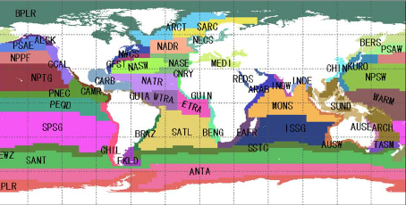
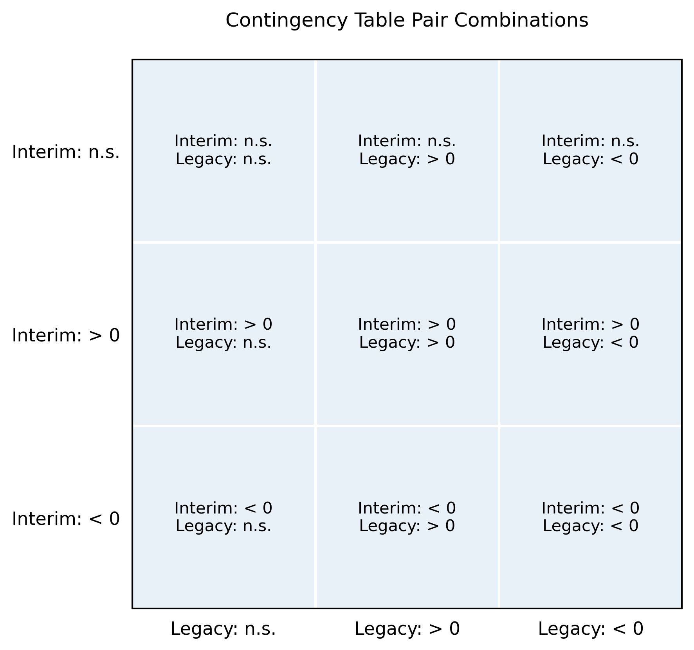
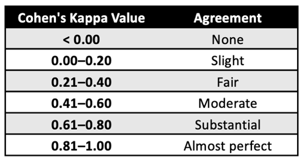
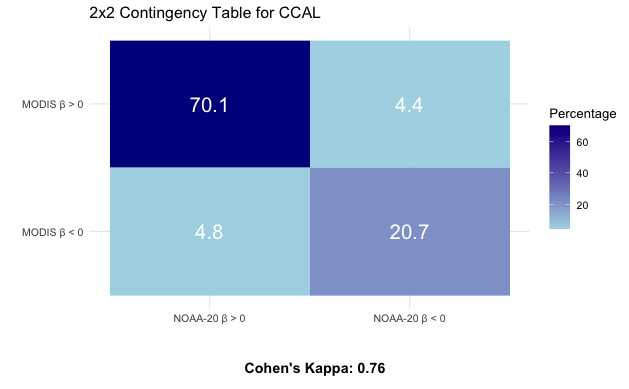
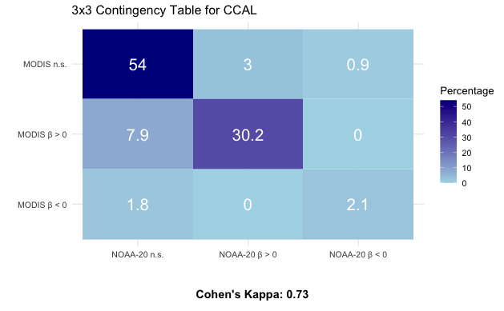

## Overview

This tutorial walks through two key analyses designed to evaluate and compare satellite-derived primary productivity (netPP) products:

1.  **Linear Regression Trends Analysis of the Interim and Legacy Products** Identifying trends during a timeseries for each sensor to track the agreement in netPP values between the legacy product, MODIS-AQUA, and interim products, VIIRS-SNPP and VIIRS-NOAA20 to provide validation that the interim netPP products can be reliably used for continuity in long-term productivity analyses.

2.  **Contingency Table and Cohen's Kappa Comparison** Compare trends over time between the legacy and an interim netPP products

The trend analysis follows methods outlined in Melin et al 2017, see the section 2.3 "Trend estimates and comparison of trends".
Users will be able to customize the notebook for their needs by selecting a region of interest using either a Longhurst Province or a custom bounding box.

We aim to validate the reliability of interim netPP products (**VIIRS-SNPP** and **VIIRS-NOAA20**) for long-term productivity analyses in comparison to the legacy **MODIS-Aqua** product.

## Datasets Overview

We calculated the pixel-by-pixel trend coefficients and p-values for the globe for each monthly at a 9km resolution across two datasets:

1.  **Temporal Trends, Primary Productivity, VIIRS NOAA-20, MODIS Aqua, Global, 9km, 2018 to 2022**

-   Distributed via the West Coast Node ERDDAP dataset at the following link: <https://coastwatch.pfeg.noaa.gov/wcn/erddap/griddap/netpp_trends_viirsnoaa20_and_modisaqua.graph>

2.  **Temporal Trends, Primary Productivity, VIIRS S-NPP, MODIS Aqua, Global, 9km, 2013 to 2022**

-   Distributed via the West Coast Node ERDDAP dataset at the following link: <https://coastwatch.pfeg.noaa.gov/wcn/erddap/griddap/netpp_trends_viirssnpp_and_modisaqua.graph>

For each dataset, linear regression was applied on a per-pixel basis to compute trend coefficients (slopes) and p-values over time.

-   **MODIS-Aqua**: 10-year (120-month) time series

-   **VIIRS-SNPP**: 10-year (120-month) time series

-   **VIIRS-NOAA20**: 5-year (60-month) time series

## Contingency Tables and Cohen's Kappa Comparison

We will compare long-term trends in netPP between legacy (**MODIS-Aqua**) and interim (**VIIRS-SNPP**, **VIIRS-NOAA**) satellite products.

### Tutorial for this notebook

In this tutorial, we focus on comparing **MODIS-Aqua** and **VIIRS-NOAA20** trends.

### Step 1: Long-Term Linear Trends in netPP

-   **Analysis**: Linear regression applied per pixel

-   **Outputs**:

    -   Slope of the trend (per pixel)

    -   p-value (significance)

    -   Number of observations (n)

### Step 2: Constructing a Contingency Matrix

Using the slope and significance results, each pixel is categorized into:

1.  **Positive Trend:** Increasing trend (positive slope).

2.  **Negative Trend:** Decreasing trend (negative slope).

3.  **No significant Trend:** Slope not significantly different than zero.

### Step 3: Quantifying Agreement with Cohen's Kappa

To statistically assess agreement between the two products:

-   **Cohen's Kappa** is calculated from the contingency matrix.

-   It accounts for agreement due to chance.

-   A higher Kappa value indicated stronger agreement in trend detection between MODIS and VIIRS.

## Shapefiles

#### Longhurst Marine Provinces

The dataset represents the division of the world oceans into provinces as defined by Longhurst (1995; 1998; 2006).
This division has been based on the prevailing role of physical forcing as a regulator of phytoplankton distribution.
The Longhurst Marine Provinces dataset is available online (<https://www.marineregions.org/downloads.php>) and within the shapes folder associated with this repository.



**For our example we will use the shapefile for the "California Upwelling Coastal Province" (ProvCode: CCAL) within the Longhurst Marine Provinces classification**.

## Resource requirements

-   **RStudio**

-   **Packages** we install below.

-   **Shapefile** of your area of interest

    -   If you don't have shapefile, we will include some workarounds in the notebook.

-   **Internet connection**

## Install and Load Required Packages

```{r}
pkges = installed.packages()[,"Package"]
# Function to check if pkgs are installed, install missing pkgs, and load
pkgTest <- function(x)
{
  if (!require(x,character.only = TRUE))
  {
    install.packages(x,dep=TRUE,repos='http://cran.us.r-project.org')
    if(!require(x,character.only = TRUE)) stop(x, " :Package not found")
  }
}

# create list of required packages
list.of.packages <- c("ncdf4", "rerddap","plotdap", "parsedate", 
                      "sp", "ggplot2", "RColorBrewer", "sf", 
                      "reshape2", "maps", "mapdata", 
                      "jsonlite", "rerddapXtracto", "dplyr",
                      "lubridate", "tidyr", "psych", "gridExtra",
                      "grid")

# Run install and load function
for (pk in list.of.packages) {
  pkgTest(pk)
}

# create list of installed packages
pkges = installed.packages()[,"Package"]
```

## Create a few useful functions

### Function to extract ERDDAP data using rxtracto_3D and rxtractogon

```{r}
#' Extract Satellite Data Using Bounding Box and Polygon
#'
#' This function extracts satellite data from an ERDDAP dataset using both a 
#' bounding box (`rxtracto_3D`) and a polygon shapefile (`rxtractogon`). It is 
#' useful for comparing region-wide vs. province-specific values.
#'
#' @param dataInfo Object returned from `rerddap::info()` representing the ERDDAP dataset.
#' @param param Character string indicating the name of the parameter to extract (e.g., "modis_beta").
#' @param lon Numeric vector of longitudes outlining the polygon (from shapefile or manual input).
#' @param lat Numeric vector of latitudes outlining the polygon.
#'
#' @return A list containing two elements:
#' \describe{
#'   \item{bbox}{Data extracted using a bounding box (via `rxtracto_3D`).}
#'   \item{prov}{Data extracted using a polygon (via `rxtractogon`).}
#' }
extract_data <- function(dataInfo, param, lon, lat) {
  list(
    bbox = rxtracto_3D(
      dataInfo,
      parameter = param,
      xcoord = c(lon_min, lon_max),
      ycoord = c(lat_min, lat_max)
    ),
    prov = rxtractogon(
      dataInfo,
      parameter = param,
      xcoord = lon,
      ycoord = lat
    )
  )
}
```

### Function to find common grid points

```{r}
#' Identify Common Grid Points Between Two Datasets
#'
#' Filters out missing values (`NA`) and returns the slope (beta) and 
#' p-value data at matching, non-missing grid points across two datasets.
#' This is a necessary preprocessing step for constructing contingency matrices
#' comparing trends between products.
#'
#' @param beta1 Numeric vector of slope values (e.g., from MODIS).
#' @param beta2 Numeric vector of slope values (e.g., from VIIRS).
#' @param pval1 Numeric vector of p-values corresponding to `beta1`.
#' @param pval2 Numeric vector of p-values corresponding to `beta2`.
#'
#' @return A list with three elements:
#' \describe{
#'   \item{beta_common}{A list of slope vectors (one from each dataset) at shared valid locations.}
#'   \item{pval_common}{A list of p-value vectors (one from each dataset) at shared valid locations.}
#'   \item{num_common}{An integer count of valid, overlapping grid points.}
#' }
find_common_points <- function(beta1, beta2, pval1, pval2) {
  mask <- !is.na(beta1) & !is.na(beta2)
  beta_common <- list(beta1[mask], beta2[mask])
  pval_common <- list(pval1[mask], pval2[mask])
  num_common <- sum(mask)
  return(list(beta_common = beta_common, pval_common = pval_common, num_common = num_common))
}
```

### Function to create 2x2 contingency table

```{r}
#' Create a 2x2 Contingency Table for Trend Direction Comparison
#'
#' Constructs a 2x2 contingency matrix that compares the direction of 
#' statistically significant trends (positive or negative) between two datasets. 
#' The table reports the percentage of grid points that fall into each combination 
#' of trend direction between the legacy and interim datasets.
#'
#' @param beta_common A list of two numeric vectors, each containing slope values (β)
#' from the legacy and interim datasets at matching grid points (as returned by `find_common_points()`).
#' @param num_common Integer representing the number of valid grid points used in the comparison.
#'
#' @return A 2x2 matrix with percentages of grid points in each category:
#' \describe{
#'   \item{Row 1}{Legacy (e.g., MODIS) β > 0}
#'   \item{Row 2}{Legacy β < 0}
#'   \item{Col 1}{Interim (e.g., NOAA-20) β > 0}
#'   \item{Col 2}{Interim β < 0}
#' }
create_2x2_contingency_table <- function(beta_common, num_common) {
  table <- matrix(0, 2, 2)
  rownames(table) <- c("MODIS β > 0", "MODIS β < 0")
  colnames(table) <- c("NOAA-20 β > 0", "NOAA-20 β < 0")
  
  table[1, 1] <- sum(beta_common[[1]] >= 0 & beta_common[[2]] >= 0) / num_common * 100
  table[1, 2] <- sum(beta_common[[1]] >= 0 & beta_common[[2]] < 0) / num_common * 100
  table[2, 1] <- sum(beta_common[[1]] < 0 & beta_common[[2]] >= 0) / num_common * 100
  table[2, 2] <- sum(beta_common[[1]] < 0 & beta_common[[2]] < 0) / num_common * 100
  
  return(table)
}

```

### Function to create 3x3 contingency tables

```{r}
#' Create a 3x3 Contingency Table for Trend Direction and Significance
#'
#' Constructs a 3x3 contingency table comparing trends between two satellite products.
#' Each pixel is classified based on the sign and statistical significance of its trend.
#' The table summarizes the agreement and disagreement across three categories: 
#' positive trend, negative trend, and no significant trend (n.s.).
#'
#' @param beta_common A list of two numeric vectors containing matched slope values 
#' (from the legacy and interim datasets), filtered using `find_common_points()`.
#' @param pval_common A list of two numeric vectors containing matched p-values 
#' for each dataset.
#' @param num_common Integer count of valid overlapping grid points.
#' @param alpha Significance threshold for trend classification (default is 0.05).
#'
#' @return A 3x3 matrix representing the percentage of grid points falling into each
#' trend-significance category pairing:
#' \describe{
#'   \item{Row 1}{Legacy n.s.}
#'   \item{Row 2}{Legacy β ≥ 0}
#'   \item{Row 3}{Legacy β < 0}
#'   \item{Col 1}{Interim n.s.}
#'   \item{Col 2}{Interim β ≥ 0}
#'   \item{Col 3}{Interim β < 0}
#' }
create_3x3_contingency_table <- function(beta_common, pval_common, num_common, alpha = 0.05) {
  
  table <- matrix(0, 3, 3)
  rownames(table) <- c("MODIS n.s.", "MODIS β > 0", "MODIS β < 0")
  colnames(table) <- c("NOAA-20 n.s.", "NOAA-20 β > 0", "NOAA-20 β < 0")
  
  ns_indices_1 <- which(pval_common[[1]] >= alpha)
  ns_indices_2 <- which(pval_common[[2]] >= alpha)
  
  table[1, 1] <- sum(ns_indices_1 %in% ns_indices_2) / num_common * 100
  table[2, 1] <- sum(ns_indices_1 %in% which(pval_common[[2]] < alpha & beta_common[[2]] >= 0)) / num_common * 100
  table[3, 1] <- sum(ns_indices_1 %in% which(pval_common[[2]] < alpha & beta_common[[2]] < 0)) / num_common * 100
  
  table[1, 2] <- sum(ns_indices_2 %in% which(pval_common[[1]] < alpha & beta_common[[1]] >= 0)) / num_common * 100
  table[1, 3] <- sum(ns_indices_2 %in% which(pval_common[[1]] < alpha & beta_common[[1]] < 0)) / num_common * 100
  
  sig_indices_1 <- which(pval_common[[1]] < alpha)
  sig_indices_2 <- which(pval_common[[2]] < alpha)
  common_indices_sig1 <- sig_indices_1[sig_indices_1 %in% sig_indices_2]
  common_indices_sig2 <- sig_indices_2[sig_indices_2 %in% sig_indices_1]
  
  reshaped_data <- list(
    beta_common[[1]][common_indices_sig1],
    beta_common[[2]][common_indices_sig2]
  )
  
  table[2, 2] <- sum(reshaped_data[[1]] >= 0 & reshaped_data[[2]] >= 0) / num_common * 100
  table[2, 3] <- sum(reshaped_data[[1]] >= 0 & reshaped_data[[2]] < 0) / num_common * 100
  table[3, 2] <- sum(reshaped_data[[1]] < 0 & reshaped_data[[2]] >= 0) / num_common * 100
  table[3, 3] <- sum(reshaped_data[[1]] < 0 & reshaped_data[[2]] < 0) / num_common * 100
  
  return(table)
}
```

### Function for computing Cohen's Kappa

```{r}
#' Compute Cohen's Kappa Statistic
#'
#' Calculates Cohen's Kappa to quantify agreement between two categorical classifications,
#' such as trend direction or significance across datasets. This statistic adjusts for 
#' the possibility of agreement occurring by chance.
#'
#' @param contingency_table A matrix (2x2 or 3x3) of percentages or counts representing
#' classification agreement between two datasets.
#'
#' @return A single numeric value representing Cohen's Kappa statistic.
#' Values range from:
#' \itemize{
#'   \item \code{< 0} — No agreement
#'   \item \code{0.0–0.20} — Slight agreement
#'   \item \code{0.21–0.40} — Fair agreement
#'   \item \code{0.41–0.60} — Moderate agreement
#'   \item \code{0.61–0.80} — Substantial agreement
#'   \item \code{0.81–1.00} — Almost perfect agreement
#' }
compute_kappa <- function(contingency_table) {
  kappa_result <- cohen.kappa(contingency_table)$kappa
  return(kappa_result)
}
```

### Function for plotting contingency tables

```{r}
#' Plot a Contingency Matrix with Cohen's Kappa Annotation
#'
#' Visualizes a 2x2 or 3x3 contingency matrix as a heatmap and displays Cohen’s Kappa 
#' statistic below the plot. Used to evaluate agreement in classification results (e.g., 
#' trend direction or significance) between two satellite-derived datasets.
#'
#' @param table A 2x2 or 3x3 matrix of percentages representing category agreement between two datasets.
#' @param title A character string used as the plot title.
#' @param kappa_value A numeric value representing the computed Cohen’s Kappa to be shown below the plot.
#'
#' @return A `grid` object containing a heatmap of the contingency table with the associated 
#' Cohen’s Kappa statistic as an annotation.
#'
#' @details The function reverses the order of the matrix rows so that "n.s." (no significant trend) 
#' appears at the top, assuming row names are in the order of increasing trend magnitude.
plot_contingency_table <- function(table, title, kappa_value) {
  # Convert matrix to data frame with row and column labels preserved
  df <- as.data.frame(as.table(table))

  # Explicitly define and enforce the factor level order
  row_levels <- rev(rownames(table))  # Reverse so "n.s." is on top
  col_levels <- colnames(table)

  df$Var1 <- factor(df$Var1, levels = row_levels)
  df$Var2 <- factor(df$Var2, levels = col_levels)

  # Generate the plot
  p <- ggplot(df, aes(x = Var2, y = Var1, fill = Freq)) +
    geom_tile() +
    geom_text(aes(label = round(Freq, 1)), color = "white", size = 6) +
    scale_fill_gradient(low = "lightblue", high = "darkblue") +
    labs(title = title, fill = "Percentage", x = "", y = "") +
    theme_minimal()

  # Add Cohen's Kappa below the plot
  kappa_text <- grid::textGrob(
    label = paste("Cohen's Kappa:", round(kappa_value, 2)),
    gp = grid::gpar(fontsize = 12, fontface = "bold")
  )

  gridExtra::grid.arrange(p, kappa_text, ncol = 1, heights = c(4, 0.5))
}

```

### Define Extraction Method: Bounding Box or Longhurst Province

For this tutorial, we are setting **use_bbox = FALSE** because we will be looking at the CCAL province.
If you do not have the Longhurst Province shapefiles, set **use_bbox = TRUE** and manually define the bounding box of interest.

```{r}
# User option: Set TRUE for bounding box, FALSE for Longhurst Province
use_bbox <- FALSE

# Path to shapefile
shapefile_path <- "/Users/madisonrichardson/netpp/resources/Longhurst/Longhurst_world_v4_2010.shp"

# Read shapefile
shapes <- read_sf(dsn = shapefile_path, layer = "Longhurst_world_v4_2010")

# Example List of all the province names
shapes$ProvCode

if (!use_bbox) {
  # Set Province Code
  ProvCode <- "CCAL"
  
  # Extract the province region
  selected_region <- shapes[shapes$ProvCode == ProvCode,]
  
  # Get bounding box of the province
  bbox <- st_bbox(selected_region)
  lon_min <- bbox["xmin"]
  lon_max <- bbox["xmax"]
  lat_min <- bbox["ymin"]
  lat_max <- bbox["ymax"]
  
  # Extract longitude & latitude for polygon
  longitude <- st_coordinates(selected_region)[,1]
  latitude  <- st_coordinates(selected_region)[,2]
  
} else {
  # Manually set bounding box
  lon_min <- -128.0
  lon_max <- -124.0
  lat_min <-  42.0
  lat_max <-  46.0
  
  longitude <- c(lon_min, lon_max, lon_max, lon_min, lon_min)
  latitude  <- c(lat_min, lat_min, lat_max, lat_max, lat_min)
}

# Print bounding box
print(paste("Bounding Box:", lon_min, lon_max, lat_min, lat_max))

```

## Select Satellite Dataset from ERDDAP

We will be using the NOAA20 Trends dataset from the West Coast Node ERDDAP Server.
The dataset ID is: **netpp_trends_viirsnoaa20_and_modisaqua**.
We will use the info function from the **rerddap** package to first obtain information about the dataset of interest, then we will import the data.

```{r}
erddap_url = "https://coastwatch.pfeg.noaa.gov/wcn/erddap/"
dataInfo <- rerddap::info('netpp_trends_viirsnoaa20_and_modisaqua', url=erddap_url)

print(dataInfo)
```

# Compare Products with Contingency Tables

## Extract MODIS and VIIRS data with griddap

Using the **griddap()** function from the rerddap package, we retrieve gridded trends and p-values for the legacy and interim datasets.
The data is extracted over the CCAL region defined by the bounding box (bbox).

```{r}
modis_ds <- griddap(
  "netpp_trends_viirsnoaa20_and_modisaqua",
  url = erddap_url,
  latitude = c(bbox["ymin"], bbox["ymax"]),
  longitude = c(bbox["xmin"], bbox["xmax"]),
  fields = c("modis_beta", "modis_pval")
)$data

viirs_ds <- griddap(
  "netpp_trends_viirsnoaa20_and_modisaqua",
  url = erddap_url,
  latitude = c(bbox["ymin"], bbox["ymax"]),
  longitude = c(bbox["xmin"], bbox["xmax"]),
  fields = c("viirs_beta", "viirs_pval")
)$data
```

## Extract Trends (beta) and Statistical Significance (pval)

Each dataset contains gridded values for `beta` and `pval`, which are stored in separate objects for further comparison.

```{r}
# Extract beta and pval from MODIS dataset
modis_beta <- modis_ds$modis_beta
modis_pval <- modis_ds$modis_pval

# Extract beta and pval from NOAA-20 dataset
viirs_beta <- viirs_ds$viirs_beta
viirs_pval <- viirs_ds$viirs_pval

```

## Finding Common Grid Points for Comparison

To compare trends between MODIS and NOAA-20 datasets, we need to identify grid points that have valid values in both datasets.
The function `find_common_points` filters out missing (NA) values and extracts the corresponding `beta` and `pval` values from both datasets.

```{r}
# Compute common grid points
common_data <- find_common_points(modis_beta, viirs_beta, modis_pval, viirs_pval)

```

## Creating a 2x2 Contingency Table

The 2x2 contingency table categorizes and compares trend directions (β values) from the legacy and interim datasets at common grid points.
The table categorizes pixels based on whether both datasets agree on the trend direction being either **positive** ($\beta>0$) or **negative** ($\beta<0$).

The function `create_2x2_contingency_table` constructs a 2x2 matrix that classifies each grid point based on positive or negative trends in each of the datasets, and computes the common grid points in each category.

```{r}
# Create 2x2 contingency table
contingency_table_2x2 <- create_2x2_contingency_table(common_data$beta_common, common_data$num_common)

# Print 2x2 contingency table
print(contingency_table_2x2)

```

## Creating a 3x3 Contingency Table

The 3x3 contingency table categorizes and compares trend directions from the legacy and interim datasets at common grid points and incorporates statistical significance (p-values) comparing agreement in non-significant trends.



The function `create_3x3_contingency_table` constructs a 3x3 matrix that categorizes each grid point based on trend significance and direction in each of the datasets and compute the percentage of common grid points in each category.

```{r}
# Create 3x3 contingency table
contingency_table_3x3 <- create_3x3_contingency_table(common_data$beta_common, common_data$pval_common, common_data$num_common)

# Print 3x3 contingency table
print(contingency_table_3x3)

```

## Computing Cohen's Kappa

Cohen's Kappa quantifies the level of agreement between trend classifications in the MODIS and NOAA-20 dataset.

Kappa values range from 0 to 1 where:

-   1.0 = Perfect Agreement

-   0.0 = No Agreement



The function `compute_kappa` calculates Cohen's Kappa for both the 2x2 and 3x3 contingency tables.

```{r}
# Compute Cohen's Kappa for both contingency tables
kappa_2x2 <- compute_kappa(contingency_table_2x2)
kappa_3x3 <- compute_kappa(contingency_table_3x3)

```

## Visualizing Contingency Tables with Cohen's Kappa

The function `plot_contingency_table` generates a contingency table with Cohen's Kappa displayed below the plot.
The contingency table represents the percentage of grid points in each classification category, while Cohen's Kappa quantifies the agreement between the two datasets.

### Plot 2x2 Contingency Table

```{r}
# Display and save 2x2 contingency table plot with Cohen's Kappa
p_2x2 <- plot_contingency_table(contingency_table_2x2, "2x2 Contingency Table for CCAL", kappa_2x2)

```


### Results for the 2x2 Contingency Table

-   70.1% of the grid points had a positive trend in both MODIS and NOAA-20.
-   20.7% of the grid points had a negative trend in both MODIS and NOAA-20.
-   Overall, there is 90.8% agreement between MODIS and NOAA-20 in the CCAL region.
-   Cohen's Kappa = 0.76 indicating substantial agreement between MODIS and NOAA-20 datasets.

### Plot 3x3 Contingency Table

```{r}
# Display and save 3x3 contingency table plot with Cohen's Kappa
p_3x3 <- plot_contingency_table(contingency_table_3x3, "3x3 Contingency Table for CCAL", kappa_3x3)

```


### Results for the 3x3 Contingency Table

-   54% of the grid points were non-significant in both MODIS and NOAA-20
-   30.2% of the grid points had a significant positive trend in both datasets.
-   2.1% of the grid points had a significant negative trend in both datasets.
-   Overall, there is 86.3% agreement between MODIS and NOAA-20 in the CCAL region.
-   Cohen's Kappa = 0.73 indicating substantial agreement between MODIS and NOAA-20 datasets.
