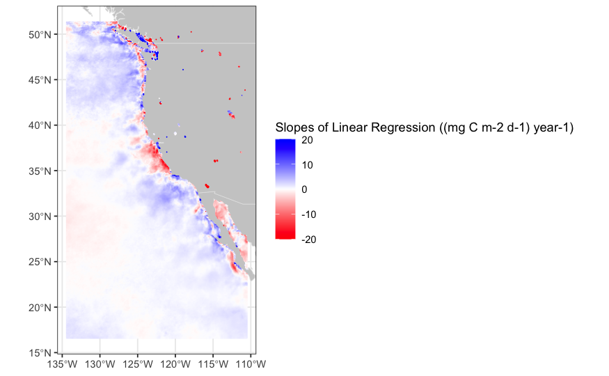
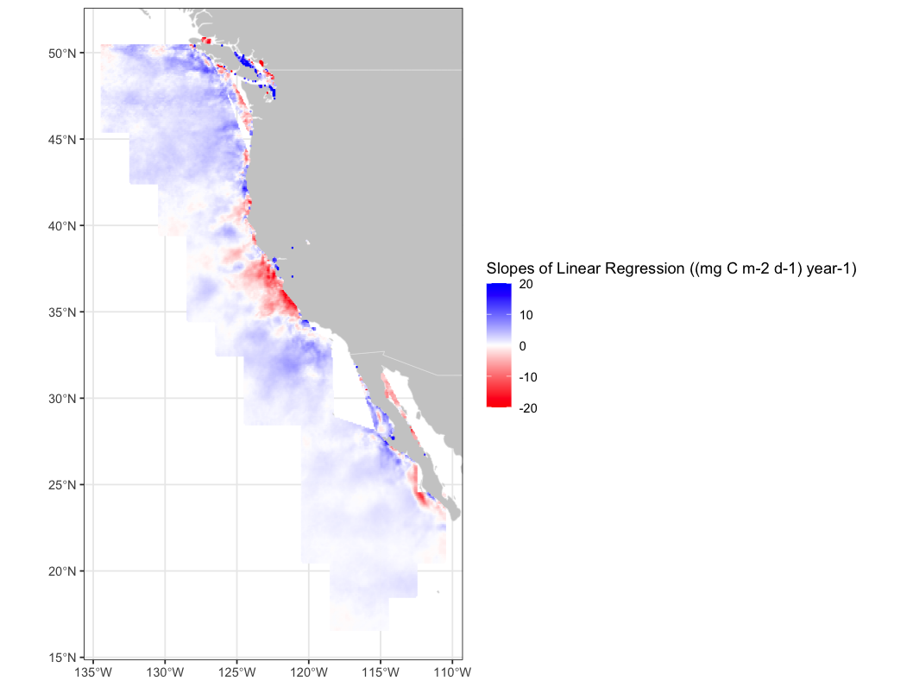

History \| Updated February 2025

# Visualizing Primary Productivity Trends for the Legacy and Interim Products

> Update: February 2025

## Overview

In this notebook, users will visualize linear trends and p-values for primary productivity. The trend analysis follows methods outlined in Melin et al 2017, see the section 2.3 "Trend estimates and comparison of trends". Users will be able to customize the notebook for their needs by selecting a region of interest using either a Longhurst Province or a custom bounding box.

We are identifying the trends during the timeseries for each sensor to track the agreement in netPP values between the legacy product, MODIS-AQUA, and interim products, VIIRS-SNPP and VIIRS-NOAA20 to provide validation that the interim netPP products can be reliably used for continuity in long-term productivity analyses.

For **MODIS-AQUA**, the result will be a **120-month (10-year)** timeseries of trend coefficients and p-values within your area of interest.

For **VIIRS-SNPP**, the result will be a **120-month (10-year)** timeseries of trend coefficients and p-values within your area of interest.

For **VIIRS-NOAA20**, the result will be a **60-month (5-year)** timeseries of trend coefficients and p-values within your area of interest.

## Datasets Overview

We calculated the pixel-by-pixel trend coefficients and p-values for the globe for each monthy at a 9km resolution across three datasets:

1.  **Trend Coefficients and P-values for Monthly Primary Productivity, MODIS-AQUA, Science Quality, Global, 9km, 2013-2022**

-   Distributed via the West Coast Node ERDDAP dataset at the following link: \> <http://localhost:8080/erddap/griddap/trends_modis_monthly_9km.graph>

2.  **Trend Coefficients and P-values for Monthly Primary Productivity, VIIRS-SNPP, Science Quality, Global, 9km, 2013-2022**

-   Distributed via the West Coast Node ERDDAP dataset at the following link: \> <http://localhost:8080/erddap/griddap/trends_snpp_monthly_9km.graph>

3.  **Trend Coefficients and P-values for Monthly Primary Productivity, VIIRS-NOAA20, Science Quality, Global, 9km, 2018-2022**

-   Distributed via the West Coast Node ERDDAP dataset at the following link: \> <http://localhost:8080/erddap/griddap/trends_noaa20_monthly_9km.graph>

## Steps

1.  Extract data from an ERDDAP data server for a non-rectangular region or bounding box using the **rerddapXtracto** package.

2.  Visualize the masked and unmasked trends on a map.

## Shapefiles

#### Longhurst Marine Provinces

The dataset represents the division of the world oceans into provinces as defined by Longhurst (1995; 1998; 2006). This division has been based on the prevailing role of physical forcing as a regulator of phytoplankton distribution. The Longhurst Marine Provinces dataset is available online (<https://www.marineregions.org/downloads.php>) and within the shapes folder associated with this repository.


**For our example we will use the shapefile for the "California Upwelling Coastal Province" (ProvCode: CCAL) within the Longhurst Marine Provinces classification**.

## Resource requirements

-   **R Studio** with the modules included within the *Install and Load Required Packages* section below

-   **Shapefile** of your area of interest

    -   If you don't have shapefile, we will include some workarounds in the notebook.

-   **Internet connection**

## Install and Load Required Packages

```{r setup, message=FALSE, warning=FALSE}
# Function to check and install missing packages
pkgTest <- function(x) {
  if (!require(x, character.only = TRUE)) {
    install.packages(x, dep = TRUE, repos = 'http://cran.us.r-project.org')
    if (!require(x, character.only = TRUE)) stop(x, " : Package not found")
  }
}

# List of required packages
list.of.packages <- c("ncdf4", "rerddap", "plotdap", "parsedate", 
                      "sp", "ggplot2", "RColorBrewer", "sf", 
                      "reshape2", "maps", "mapdata", 
                      "jsonlite", "rerddapXtracto")

# Install and load each package
for (pk in list.of.packages) {
  pkgTest(pk)
}
```

### Define Extraction Method: Bounding Box or Longhurst Province

For this tutorial, we are setting **use_bbox = FALSE** because we will be looking at the CCAL province. If you do not have the Longhurst Province shapefiles, set **use_bbox = TRUE** and manually define the bounding box of interest.

```{r define-method, message=FALSE, warning=FALSE}
# User option: Set TRUE for bounding box, FALSE for Longhurst Province
use_bbox <- FALSE

# Path to shapefile
shapefile_path <- "/Users/madisonrichardson/netpp/resources/Longhurst/Longhurst_world_v4_2010.shp"

# Read shapefile
shapes <- read_sf(dsn = shapefile_path, layer = "Longhurst_world_v4_2010")

if (!use_bbox) {
  # Set Province Code
  ProvCode <- "CCAL"
  
  # Extract the province region
  selected_region <- shapes[shapes$ProvCode == ProvCode,]
  
  # Get bounding box of the province
  bbox <- st_bbox(selected_region)
  lon_min <- bbox["xmin"]
  lon_max <- bbox["xmax"]
  lat_min <- bbox["ymin"]
  lat_max <- bbox["ymax"]
  
  # Extract longitude & latitude for polygon
  longitude <- st_coordinates(selected_region)[,1]
  latitude  <- st_coordinates(selected_region)[,2]
  
} else {
  # Manually set bounding box
  lon_min <- -128.0
  lon_max <- -124.0
  lat_min <-  42.0
  lat_max <-  46.0
  
  longitude <- c(lon_min, lon_max, lon_max, lon_min, lon_min)
  latitude  <- c(lat_min, lat_min, lat_max, lat_max, lat_min)
}

# Print bounding box
print(paste("Bounding Box:", lon_min, lon_max, lat_min, lat_max))

```

## Select Satellite Dataset from ERDDAP

We will be using the NOAA20 Trends dataset from the West Coast Node ERDDAP Server. The dataset ID is: **trends_noaa20_monthly_9km**. We will use the info function from the **rerddap** package to first obtain information about the dataset of interest, then we will import the data.

```{r sat-data, message=FALSE, warning=FALSE}
# Print bounding box
print(paste("Bounding Box:", lon_min, lon_max, lat_min, lat_max))

# Set ERDDAP URL
erddap_url = "http://localhost:8080/erddap"

# Get dataset info
dataInfo <- rerddap::info('trends_noaa20_monthly_9km', url=erddap_url)  
print(dataInfo)

```

## Extract Data from ERDDAP

Using the **rxtracto_3D function** for the bounding box, we will import the satellite data from erddap.

Using the **rxtractogon function** for the province, we will import the satellite data from erddap. The rxtractogon function takes the variable(s) of interest and the coordinates as input. The rxtractogon function automatically extracts data from the satellite dataset and masks out any data outside the polygon boundary.

We are interested in trends, so we set the parameter to beta because that's what it's called in the dataset.

There is only one timestamp in the dataset, so that's what we use.

Above, we set our xcoords (longitude) and ycoords (latitude) so we will use those ranges here.

```{r extract-data, message=FALSE, warning=FALSE}
# Define parameter and time range
parameter <- 'beta'
trends_time <- c("2018-01-16T12:00:00Z")

# Extract **full bounding box data**
bbox_data <- rxtracto_3D(
  dataInfo,
  parameter = parameter,
  xcoord = c(lon_min, lon_max),
  ycoord = c(lat_min, lat_max),
  tcoord = c("2018-01-16 12:00:00", "2018-01-16 12:00:00")
)
#List the returned data
str(bbox_data)

# Extract **province-masked data**
prov_data <- rxtractogon(
  dataInfo,
  parameter = parameter,
  xcoord = longitude,
  ycoord = latitude,
  tcoord = trends_time
)
#List the returned data
str(prov_data)
```

## Normalize Data Range for Visualization

Since satellite trend values can be extreme, normalize them for better visualization.

```{r data-range, message=FALSE, warning=FALSE}
# Set minimum and maximum values
prov_data$beta[prov_data$beta < -20] <- -20
bbox_data$beta[bbox_data$beta < -20] <- -20
prov_data$beta[prov_data$beta > 20] <- 20
bbox_data$beta[bbox_data$beta > 20] <- 20

```

## Visualize the Trends

Use the **plotBBox function** in the **rerddapXtracto** package to plot the data.

```{r bbox-plot, message=FALSE, warning=FALSE}
# Define custom color palette
custom_colors <- colorRampPalette(c("red", "white", "blue"))(100)

# Plot the full bounding box
plotBBox(bbox_data,
         plotColor = custom_colors,
         maxpixels = 1000000,
         name = 'Slopes of Linear Regression ((mg C m-2 d-1) year-1)'
)

```



```{r province-plot, message=FALSE, warning=FALSE}
# Plot the masked province
plotBBox(prov_data,
         plotColor = custom_colors,
         maxpixels = 1000000,
         name = 'Slopes of Linear Regression ((mg C m-2 d-1) year-1)'
)

```


